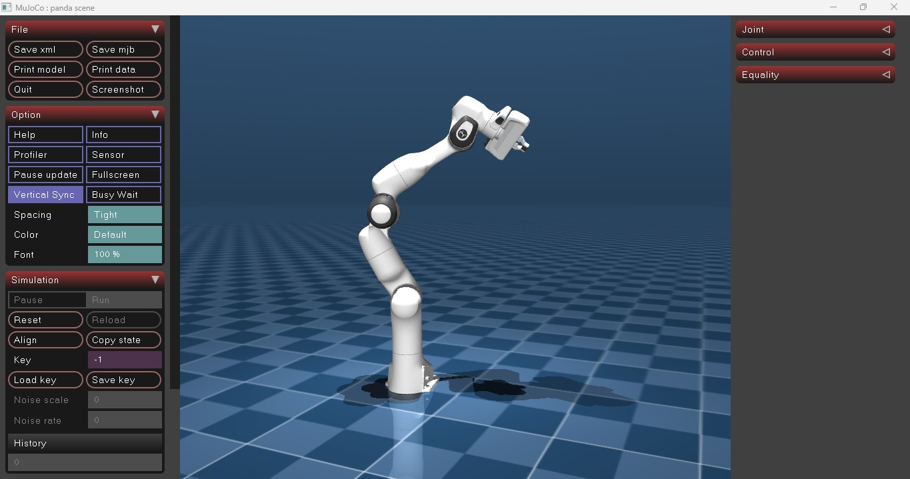

# Robotics simulation
Welcome to my robotics simulation project. Here I will play with MuJoCo, robotics controls python libraries, and AI.




If you want to contribute, just leave a PR.

# How to install and run
This project uses external repositories like 'Mujoco Manageries' as a source of URDF model files. 

## So first, clone URDF sources in external directories:

```
git clone https://github.com/google-deepmind/mujoco_menagerie.git
```

Clone this repo in other directory (you will run the models of other directories from here)
```
git clone https://github.com/ChristianBarreto/robotcs_sim.git
cd robotics_sim
```

## Run models
Each robot has its directory that point to its own model.

```
python robot_directory/simulate.py
```

